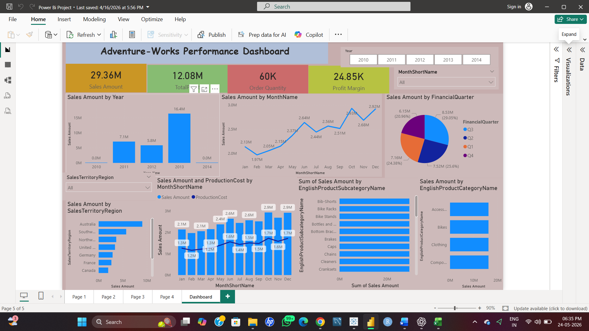
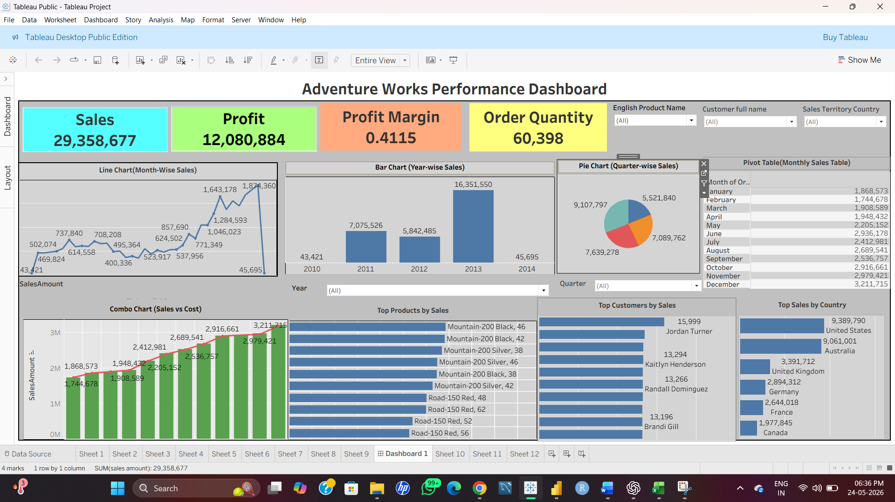
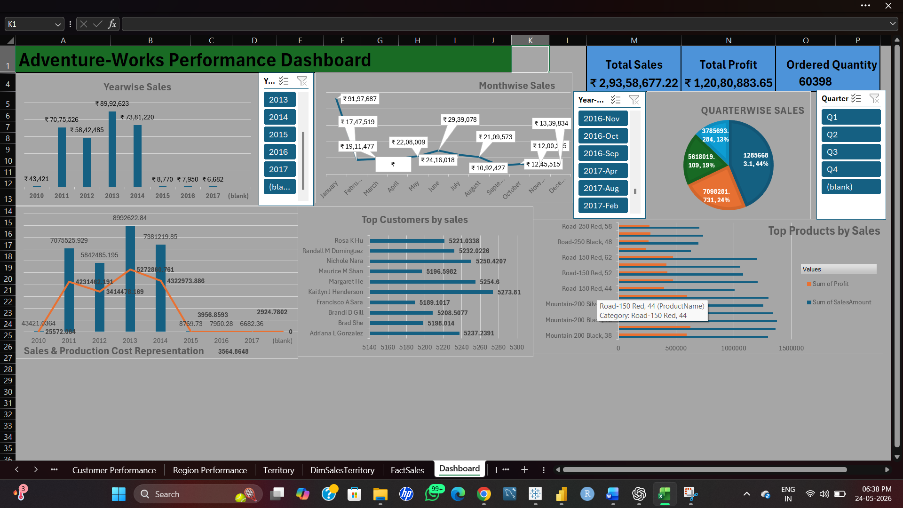

# Project-Analysis
Adventure-works Project

## 📊 Power BI Dashboard

## 📈 Tableau Dashboard

## 📊 Excel Dashboard

## 📁 Project Structure
- SQL → Data analysis using SQL
- PowerBI → Dashboard visualization
- Tableau → Interactive dashboards
- excel → Data analysis

  ## 🔗 Contact

 Email: [madhavi170691@gmail.com](mailto:madhavi170691@gmail.com)

 Resume: [View Resume](Excelr Resume.pdf)

View Links from my Google drive
Tableau - https://drive.google.com/file/d/1RDkccsd_sIefQjsZi6-Hhgjn8dxBFqXb/view?usp=sharing
Excel - https://docs.google.com/spreadsheets/d/1BcJAKAI3xhiW2cA7e07ofnQCxXYnNe1X/edit?usp=sharing&ouid=113814594491696851260&rtpof=true&sd=true
Power Bi - https://drive.google.com/file/d/1jPk8M2kiCIqcmHQLcA9CHVG68qawrIEk/view?usp=sharing
MySQL - https://drive.google.com/file/d/1rmb5wJ92lUzGbmskc9JJl-g0BQ0b9Mk8/view?usp=sharing
